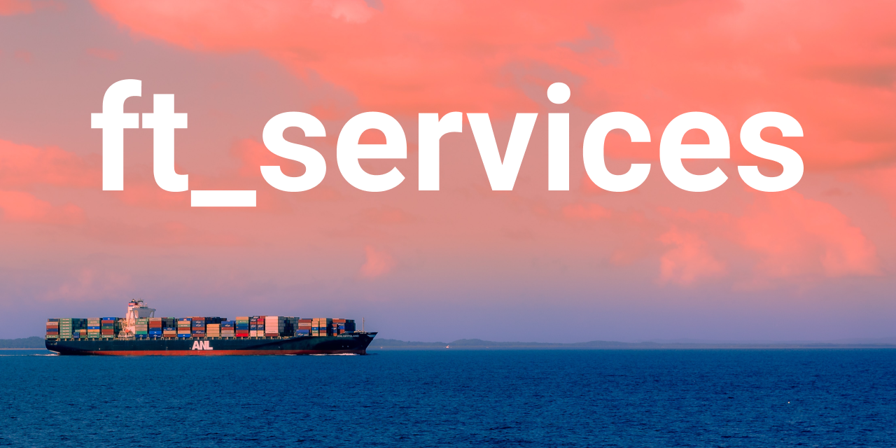
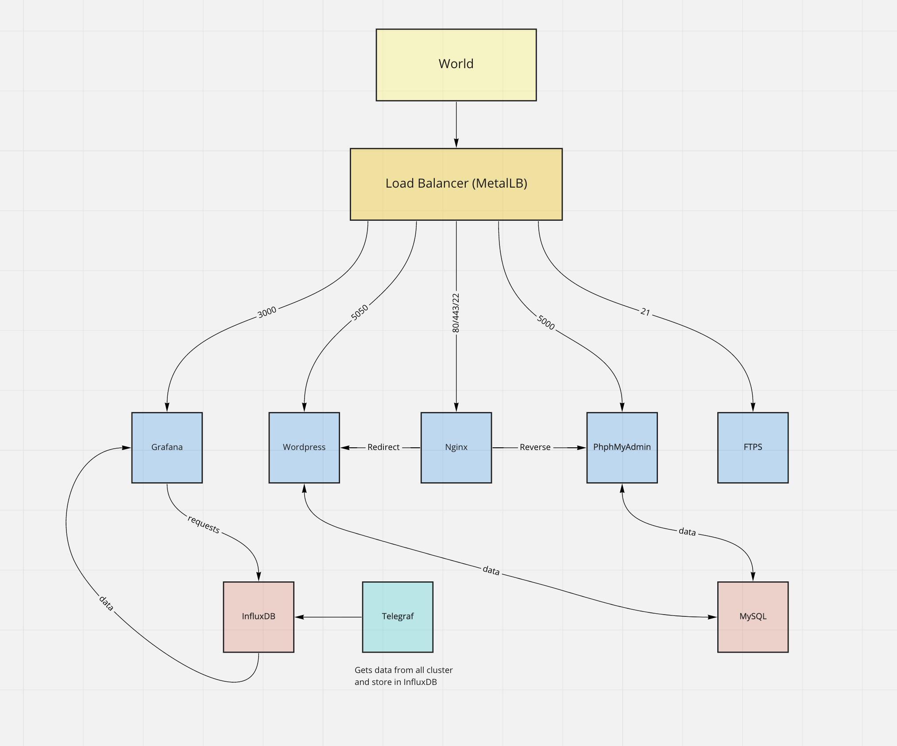
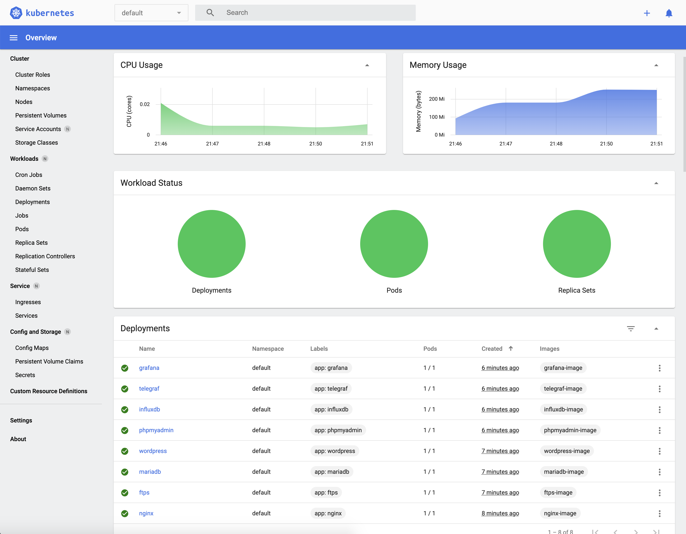
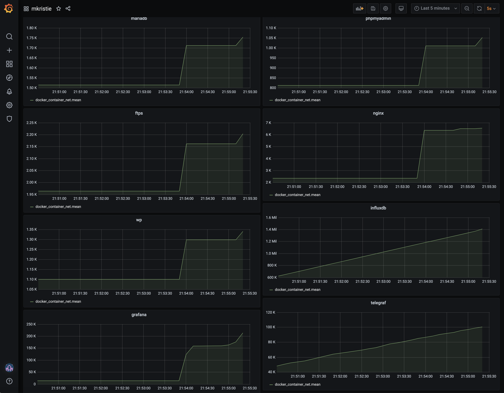
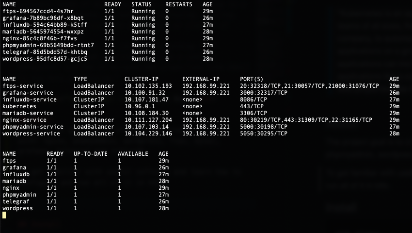

# ft_services [in process...]
Learning to use Kubernetes


<span>Photo by <a href="https://unsplash.com/@borderpolarphotographer?utm_source=unsplash&amp;utm_medium=referral&amp;utm_content=creditCopyText">Borderpolar Photographer</a> on <a href="https://unsplash.com/s/photos/container?utm_source=unsplash&amp;utm_medium=referral&amp;utm_content=creditCopyText">Unsplash</a></span>
<br/><br/><br/>

> "Kubernetes is an open source project that enables software teams of all sizes, from a small startup to a Fortune 100 company, to automate deploying, scaling, and managing applications on a group or cluster of server machines.
>These applications can include everything from internal-facing web applications like a content management sysrtem to marquee web properties like Gmail to big data processing."

<div style="text-align: right">— Joe Beda</div>

## About
The project goal is to create a kubernetes cluster with: nginx, phpmyadmin, wordpress, ftps, mysql, grafana, telegraf and influxdb.

To get familiar with useful software and learn how to configure and run all of it in k8s.





## Install
```
git clone https://github.com/kukinpower/ft_services.git
cd ft_services
sh setup.sh
```

## ⏱ Save your time

### Custom cli dashboard
Feel free to use `my_dashboard.sh` to see pretty k8s custom dashboard in your cli
```
sh my_dashboard.sh
```


### Custom aliases
My k8s aliases
```
alias k=kubectl
alias ks="k get svc"
alias kp="k get po"
alias kd="k get deployments"
alias md="minikube stop && minikube delete"
```

### Enabling zsh autocompletion
Add this to `~/.zshrc`
```
source <(kubectl completion zsh)
```

### Useful commands
```
kubectl get pods
kubectl get replicaset
kubectl create deployment nginx-deployment --image=nginx
kubectl edit deployment [name]
kubectl logs [pod name]
kubectl exec -it [pod name] -- bin/sh
kubectl cp [pod name]:[dir or file name] [desired path to dir or file name]
```

## 🕵🏼‍♀️ Research

* [Kubernetes Tutorial for Beginners [Full Course in 4 Hours]](https://youtu.be/X48VuDVv0do)
* [Kubernetes cheatsheet](https://kubernetes.io/docs/reference/kubectl/cheatsheet/)

Kubernetes has a plug-n-play architecture that allows to extend it when need to.

Health checks are available from a box. Such as: TCP, HTTP or container execution.

### Pod

Pod is container in k8s

Pods can be assigned to nodes

Pods can use persistent volumes to store data

In Kubernetes, all containers run in pods.

Some examples:

`kubectl create deployment nginx --image=nginx:1.10.0`

`kubectl get pods` to view the pods.

To expose the nginx container outside Kubernetes
`kubectl expose deployment nginx --port 80 --type LoadBalancer`

`kubectl get services` to view services

`kubectl scale deployment nginx --replicas 3`
creates 3 replica pods

built-in pod documentation `kubectl explain command`

`kubectl describe pods [NAME]` to get more info

`kubectl port-forward` to map a local port to a port inside the monolith pod

`kubectl port-forward monolith 10080:80`

How to see which `node` a `pod` belongs?
```
kubectl get pod -o=custom-columns=NODE:.spec.nodeName,NAME:.metadata.name --all-namespaces
```

or simply `kubectl get pods -o wide`

`kubectl logs -f monolith` to get a stream of logs in real time

Deployment manages a ReplicaSet
Replicaset manages a Pod
Pod is an abstraction of Container

## Author
[Roman Kukin](https://github.com/kukinpower)
